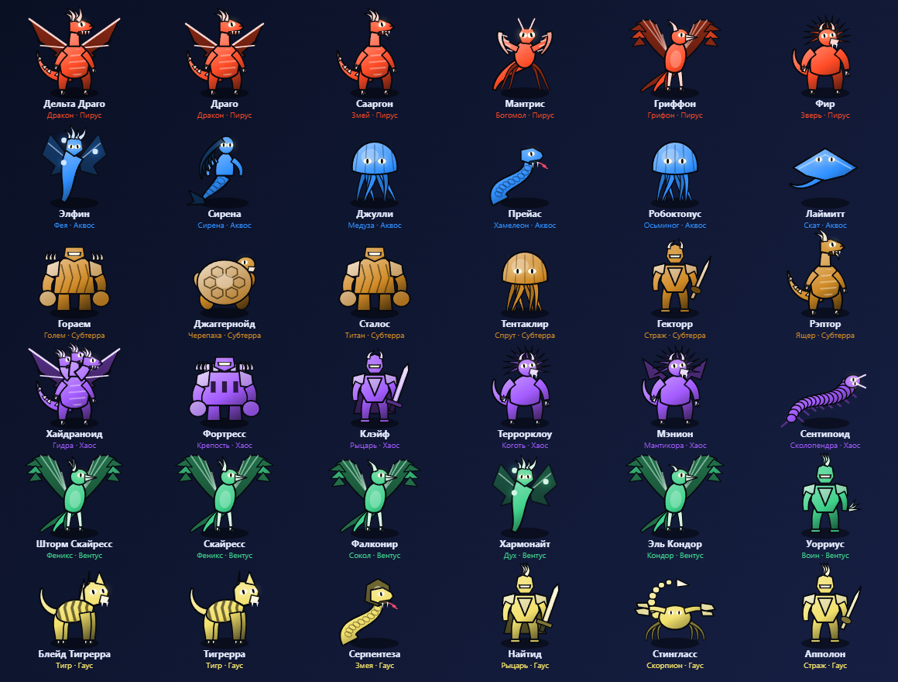
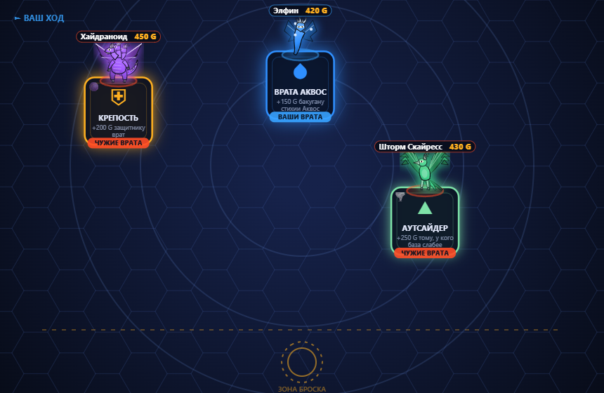
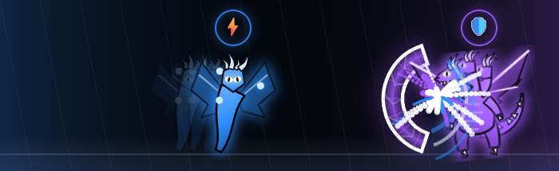

<div align="center">

# 🔥 БАКУГАН — Битва Бойцов

**Браузерная игра по мотивам Bakugan: бросок с физикой, карты врат, коллекция, магазин и онлайн-бои.**

Ни одной библиотеки, ни одной картинки, ни одного `pip install`.
Вся графика рисуется кодом на canvas, все звуки синтезируются через Web Audio,
сервер — Python из стандартной поставки, данные — SQLite3.

[](https://www.python.org/)
[](https://www.sqlite.org/)


[English](README.md) · **Русский**



<sub>Все 36 бакуганов. Ни одного файла с картинкой — каждое существо собирается процедурно на canvas.</sub>

</div>

---

## Что это

Настольная Bakugan, перенесённая в браузер целиком: вы выкладываете карты врат,
бросаете бакугана на арену, он катится с трением и раскрывается там, где остановится.
Если попал на врата соперника — начинается битва: карты способностей, стихийные
преимущества, анимация атаки и защиты, построчный расчёт G-силы.

За бои дают жетоны, на жетоны в магазине покупаются новые бакуганы и карты.
Играть можно против ИИ или против живого соперника — по общей очереди или
позвав друга напрямую.

<div align="center">

<br><sub>Арена: существа стоят на своих картах врат, у каждой карты видна стихия и хозяин.</sub>
<br><br>

<br><sub>Битва: атакующий бьёт, защитник держит гранёный щит своей стихии.</sub>
</div>

---

## Запуск

Нужен только Python 3.8+. Ставить ничего не надо.

```bash
git clone https://github.com/loliksudoc/bakugan.git
cd bakugan
python server.py
```

Откройте <http://localhost:8123>. На Windows можно просто дважды кликнуть `start.bat`.

При первом запуске рядом появится `bakugan.db` — в нём аккаунты, коллекции,
жетоны, друзья, история боёв и покупок.

---

## Возможности

### 🎮 Игровой процесс
- **Бросок на навык.** Нажатием ловите сначала угол, потом силу. Шар катится с трением,
  отскакивает от бортов и раскрывается там, где остановился. Промах — ход потерян.
- **Карты врат по очереди.** В начале хода игрок выкладывает одну карту врат на
  свободную площадку. На арене одновременно до трёх врат; на своих вратах бакуган
  получает +50 G.
- **Битва.** Каждый играет до одной карты способности, затем сравниваются итоговые
  G-силы. При равенстве врата удерживает защитник. Кто первым заберёт трое врат — победил.
- **8 типов врат** и **8 карт способностей**, у каждой своя стихия и «созвучие» +30 G.

### 🐉 36 бакуганов, нарисованных кодом
Десять архетипов тела — дракон, кошачьи, птицы, змеи, насекомые, големы, рыцари,
водные, звери, духи. Из вида существа собирается силуэт: корпус, шея, голова, рога,
крылья, хвост, лапы, светящиеся глаза. Стихия задаёт палитру, имя — приметы:
четыре рога у Дельта Драго, три головы у Хайдраноида, клинки на плечах у Блейд Тигрерры.

Один и тот же рисунок работает и портретом на карточке, и фигурой на арене,
и крупным бойцом в анимации боя.

### ⚔️ Анимация атаки и защиты
Изготовка → разбег со шлейфом → удар по гранёному щиту с искрами и тряской →
щит трескается и рассыпается **или** атакующего отбрасывает назад →
добивание или контратака → «ЗАЩИТА ПРОБИТА» / «АТАКА ОТБИТА».
И только потом построчно раскрывается расчёт G-силы.

### 🌐 Онлайн-бои
Живой соперник через общую очередь или прямое приглашение другу.
Обмен — длинный опрос: соединение висит до 18 секунд и просыпается, как только
соперник сходил. Никаких WebSocket и внешних библиотек.

Чтобы броски не разошлись, бросающий сам считает исход и присылает его вместе
с углом и силой; случайные врата разыгрываются по общему сиду — итог битвы
у обоих совпадает до единицы G. Карты способностей выбираются одновременно
и вскрываются вместе.

### 👥 Друзья
Поиск по никнейму, заявки в друзья, статус «в сети» и «в бою», приглашение
на бой напрямую мимо очереди. Никнеймы уникальны без оглядки на регистр
и лишние пробелы — и для кириллицы тоже.

### 🛒 Аккаунты, коллекция, магазин
Регистрация с выбором стихии: стартовый набор целиком в ней — три бакугана,
шесть карт врат, пять карт способностей и 100 жетонов.
Пароли — PBKDF2-HMAC-SHA256, 120 000 итераций, своя соль на пользователя.
Сессия — токен в HttpOnly-куке.

| Товар | Цена |
|---|---|
| Бакуган ★☆☆ / ★★☆ / ★★★ | 🪙 120 / 260 / 500 |
| Карта способности (любой тип × любая стихия) | 🪙 60 |
| Карта врат (любой тип × любая стихия) | 🪙 45 |
| Смена никнейма | 🪙 150 |
| Смена стихии | 🪙 400 |

Все цены и проверки живут на сервере — клиент не может выдать себе жетоны или предмет.

### 🔊 Звук без единого файла
Свист броска, шум катящегося шара с меняющимся тембром, отскоки, аккорд раскрытия,
звон щита, хруст пробитого барьера, взрыв, фанфары — всё синтезируется
осцилляторами и шумом через Web Audio.

---

## Правила

**Стихии.** Пирус (Огонь) → Вентус (Ветер) → Субтерра (Земля) → Аквос (Вода) →
Хаос (Тьма) → Гаус (Свет) → Пирус. Каждая бьёт следующую: **+100 G**.

**Команда.** В бой берутся 3 бакугана из коллекции, суммарная G-сила не выше **1150** —
трёх легендарных не собрать.

**Итог битвы** = базовая G + бонус хозяина врат + эффект врат + созвучие стихии
+ стихийное преимущество + карты способностей.

<details>
<summary><b>Карты врат</b></summary>

| Карта | Эффект |
|---|---|
| ◈ Обычные | без эффекта |
| ❂ Стихийные | +150 G бакугану своей стихии |
| ⇄ Обмен | базовые G меняются местами |
| ▲ Аутсайдер | +250 G тому, у кого база слабее |
| ⛨ Крепость | +200 G защитнику врат |
| ✖ Тишина | карты способностей не работают |
| ◐ Зеркало | стихийные преимущества не работают |
| ✦ Хаос | обоим случайно от −100 до +200 G |

</details>

<details>
<summary><b>Карты способностей</b></summary>

| Карта | Эффект |
|---|---|
| 💥 Взрывной удар | +150 G своему бакугану |
| 🥀 Иссушение | −120 G бакугану соперника |
| 🔄 Инверсия | итоговые G меняются местами |
| 🛡 Барьер | отменяет способность соперника |
| 🪞 Отражение | своя G = G соперника + 60 |
| ⚡ Ярость стихии | +100, и ещё +150 при преимуществе стихии |
| 🔓 Взлом врат | отменяет эффект карты врат |
| ☯ Равновесие | обе G = среднему; играющий получает +80 |

</details>

**Управление.** Клик по карте врат → клик по подсвеченной площадке.
Клик по бакугану → `Пробел` (угол) → `Пробел` (сила).

---

## Как устроено

```
server.py           HTTP-сервер, JSON API и SQLite3 — только стандартная библиотека
start.bat           запуск в один клик на Windows
data/catalog.json   общий справочник: бакуганы, карты, цены, сложности
index.html          разметка и все окна
css/style.css       оформление
js/api.js           обёртка над fetch
js/catalog.js       загрузка справочника с сервера
js/creatures.js     процедурная рисовка существ
js/sound.js         синтезатор звуков на Web Audio
js/auth.js          вход, регистрация, шапка профиля, магазин
js/friends.js       друзья, заявки, приглашения на бой
js/mp.js            онлайн-бой: очередь, синхронизация ходов, сдача
js/game.js          игровая логика, физика броска, ИИ, анимация боя
js/app.js           точка входа
```

`data/catalog.json` читают и клиент, и сервер — характеристики и цены не могут разойтись.

<details>
<summary><b>API</b></summary>

| Метод | Путь | Назначение |
|---|---|---|
| `GET` | `/api/catalog` | справочник игры |
| `POST` | `/api/register` · `/api/login` · `/api/logout` | аккаунт |
| `GET` | `/api/me` | профиль и коллекция |
| `POST` | `/api/game/result` | итог боя с ИИ, начисление жетонов |
| `POST` | `/api/shop/buy` | покупка |
| `GET` | `/api/leaderboard` | топ бойцов |
| `GET` | `/api/friends` | друзья, заявки, приглашения |
| `POST` | `/api/friends/add` · `/accept` · `/remove` | заявки в друзья |
| `POST` | `/api/mp/queue` · `GET /api/mp/status` | общая очередь |
| `POST` | `/api/mp/invite` · `/api/mp/accept` | бой с другом |
| `GET` | `/api/mp/sync` | длинный опрос ходов соперника |
| `POST` | `/api/mp/move` · `/finish` · `/leave` | ход, итог, сдача |

**Таблицы:** `users`, `sessions`, `user_bakugan`, `user_cards`, `matches`,
`purchases`, `friends`, `mp_queue`, `mp_match`, `mp_move`, `mp_seen`, `mp_invite`.

</details>

Сервер слушает только `127.0.0.1`. Порт меняется переменной окружения `BAKUGAN_PORT`.

> **Для игры вдвоём** нужны две разные сессии браузера: два браузера или обычное
> окно плюс приватное — иначе оба входа окажутся в одном аккаунте.

---

<div align="center">
<sub>Сделано ради удовольствия. Bakugan — торговая марка своих правообладателей;
это фанатский любительский проект, не связанный с ними.</sub>
</div>
